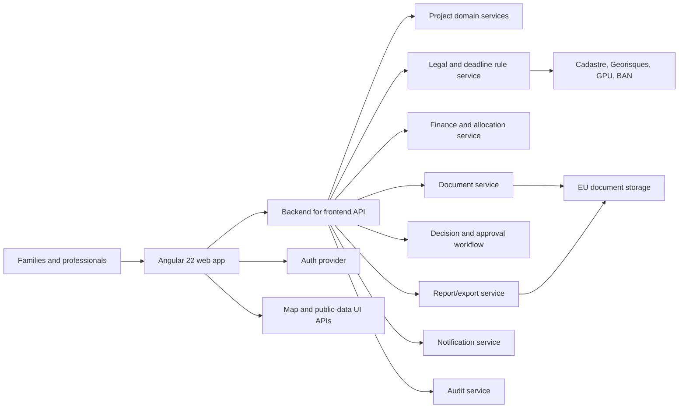

# Angular 22 High-Level Application Architecture

Status: Draft architecture
Target frontend: Angular 22 web application
Related product specification: [house-construction-france-software-spec.md](house-construction-france-software-spec.md)

## 1. Architecture Goals

The application must support a complex, evidence-heavy construction project with private family data, shared assets, legal scenarios, financial allocations, documents, deadlines, approvals, and audit trails. The frontend architecture must therefore be modular, auditable, permission-aware, offline-capable for site usage, and strict about separating active project data from simulations and scenarios.

Primary goals:

1. Build a maintainable Angular 22 application using standalone APIs, lazy routing, strict TypeScript, typed forms, signals, and clear domain boundaries.
2. Treat each product area as a bounded feature with its own routes, state facade, API adapter, forms, and UI components.
3. Keep shared/private project scope visible in the data model and UI at all times.
4. Support a progressive MVP while leaving space for advanced modules such as OCR, mapping, exports, supplier catalogs, and offline field workflows.
5. Avoid embedding legal rules in components; rule evaluation must be data-driven and returned by the backend or a dedicated rule service.

## 2. System Context

The Angular app is the authenticated user interface. It must not be responsible for authoritative legal calculations, document storage security, payment processing, OCR processing, PDF rendering at scale, or audit-log integrity. Those responsibilities belong to backend services.

Current MVP deployment snapshot:

1. The frontend is deployed on Vercel from GitHub.
2. The first backend-for-frontend endpoint is a Vercel Function at `GET /api/projects/42/shell`.
3. The function reads project shell fields from a Supabase `projects` table using server-side environment variables.
4. The current Supabase-backed project uses numeric database id `42`; the Angular route id is represented as the string `'42'`.
5. Shell navigation and shell metrics are still generated in the Vercel Function from local constants.
6. The Angular app calls the function through `ProjectApiService` and falls back to the mock project service if the function is unavailable.



## 3. Frontend Architectural Style

Use a feature-first standalone Angular architecture:

1. Standalone bootstrapping in `app.config.ts`.
2. Route-level lazy loading for every major domain.
3. Smart route containers per feature; presentational components remain reusable and side-effect free.
4. Signal-based local and view state.
5. RxJS for HTTP streams, cancellation, uploads, realtime updates, and websocket/server-sent event flows.
6. Typed reactive forms for complex legal, financial, and document workflows.
7. Domain facades to isolate components from raw HTTP services.
8. API DTOs mapped to frontend view models at feature boundaries.
9. Object-level permission checks at route guards, feature facades, and component action visibility.
10. Audit-sensitive commands routed through explicit command services rather than direct entity mutation from UI components.

## 4. Proposed Workspace Structure

The initial Angular project should use one application and internal libraries. If an Nx workspace is adopted later, the same boundaries can become Nx libraries.

```text
src/
  app/
    app.config.ts
    app.routes.ts
    app.component.ts
    core/
      auth/
      config/
      errors/
      http/
      i18n/
      logging/
      permissions/
      telemetry/
    layout/
      shell/
      navigation/
      project-switcher/
      command-bar/
    shared/
      components/
      directives/
      pipes/
      forms/
      tables/
      charts/
      files/
      maps/
      dates/
      money/
    domains/
      project/
      land/
      legal-structure/
      urbanism-permits/
      design-technical/
      budget-financing/
      contracts-professionals/
      procurement-materials/
      schedule/
      site-quality/
      documents/
      decisions-meetings/
      shared-assets/
      risks/
      reports-exports/
      settings/
    data-access/
      api-client/
      models/
      upload/
      realtime/
      offline/
    state/
      current-user.store.ts
      current-project.store.ts
      notification-center.store.ts
      offline-queue.store.ts
    styles/
      tokens/
      themes/
      utilities/
```

Boundary rule: feature components may depend on `core`, `shared`, `data-access`, and their own domain folder. Feature components must not import another domain's private components or services directly. Cross-domain behavior should go through domain facades or shared application services.

## 5. Route Architecture

Top-level routing must be project-scoped after authentication.

```text
/auth/sign-in
/auth/callback
/projects
/projects/new
/projects/:projectId/dashboard
/projects/:projectId/land
/projects/:projectId/legal-structure
/projects/:projectId/urbanism-permits
/projects/:projectId/design-technical
/projects/:projectId/budget-financing
/projects/:projectId/contracts-professionals
/projects/:projectId/procurement-materials
/projects/:projectId/schedule
/projects/:projectId/site-quality
/projects/:projectId/documents
/projects/:projectId/decisions-meetings
/projects/:projectId/shared-assets
/projects/:projectId/risks
/projects/:projectId/reports-exports
/projects/:projectId/settings
```

Route guards:

1. `authGuard`: user is authenticated.
2. `projectAccessGuard`: user has access to the project.
3. `projectPhaseGuard`: optional guard for workflows that require prerequisite phases.
4. `permissionGuard`: route-level permission check for sensitive areas such as finance, settings, exports, and private documents.
5. `dirtyFormGuard`: prevents losing unsaved legal, budget, contract, or decision changes.

Route resolvers should be kept thin. They may load current project shell data, permissions, navigation counters, and feature flags, but feature data should be fetched by domain facades after route activation.

## 6. Application Shell

The shell must provide stable navigation and project context:

1. Project switcher.
2. Household/family scope selector.
3. Active phase indicator.
4. Global search.
5. Notification center.
6. Missing-action counters.
7. Offline/sync status.
8. User profile and role indicator.
9. Command bar for common actions: upload document, add invoice, add decision, add risk, create task.

The shell must visually distinguish:

1. Family A private scope.
2. Family B private scope.
3. Shared project scope.
4. Professional/external viewer scope.
5. Scenario mode vs active project mode.

## 7. Domain Feature Boundaries

### 7.1 Project and Onboarding

Responsibilities:

1. Project creation wizard.
2. Two-family/single-land mode setup.
3. Family, house, parcel, and shared asset initialization.
4. Initial risk, document, budget, and governance templates.
5. Current project context.

Primary routes:

1. `/projects`
2. `/projects/new`
3. `/projects/:projectId/dashboard`

Key components:

1. Project creation wizard.
2. Project dashboard.
3. Phase timeline.
4. Two-family readiness panel.
5. Critical blockers panel.

### 7.2 Land

Responsibilities:

1. Parcel identity and cadastral references.
2. Land acquisition workflow.
3. Boundary, easements, access, utilities, risks.
4. Land due-diligence checklist.
5. Notaire question pack inputs.

Important UI patterns:

1. Parcel summary card.
2. Map viewer.
3. Easement matrix.
4. Purchase-condition deadline tracker.
5. Due-diligence completeness score.

### 7.3 Legal Structure

Responsibilities:

1. Indivision, parcel division, lotissement, PCVD, horizontal co-ownership, SCI, and mixed-structure scenarios.
2. Scenario comparison.
3. Professional validation workflow.
4. Exit and dispute-prevention checklist.
5. Adoption of one scenario into active project data.

Architectural rule: scenario state must be isolated from active project state until a user adopts it through a decision workflow.

### 7.4 Urbanism and Permits

Responsibilities:

1. PLU/PLUi and zoning rule tracking.
2. Planning authorization workflows.
3. Permit dossier checklist.
4. Field posting evidence.
5. Recourse and permit validity deadlines.
6. DOC and DAACT milestones.

The frontend must display rule source, source date, confidence, and professional validation status for each planning rule.

### 7.5 Design and Technical Studies

Responsibilities:

1. Design versions.
2. Architect and technical study coordination.
3. RE2020, soil, sanitation, electrical, gas, accessibility, seismic, and risk prescriptions.
4. Technical blockers before permit, contract, site opening, and completion.

### 7.6 Budget and Financing

Responsibilities:

1. Global budget.
2. Family A private budget.
3. Family B private budget.
4. Shared budget.
5. Cost allocation rules.
6. Settlement ledger.
7. Loans, drawdowns, taxes, fees, and cash forecast.

Architectural rule: every budget mutation must be a command with reason, actor, previous value, new value, and affected scope so the audit log can be reconstructed.

### 7.7 Contracts and Professionals

Responsibilities:

1. Contact directory.
2. CCMI, architect, maitre d'oeuvre, contractor, supplier, and self-build contract tracking.
3. Quote comparison.
4. Insurance certificate validation.
5. Ready-to-sign checklist.

### 7.8 Procurement and Materials

Responsibilities:

1. Material catalog.
2. Quote-to-order workflow.
3. Approval by family scope.
4. Delivery calendar.
5. Inventory and site logistics.
6. Substitution impact warnings.

### 7.9 Schedule

Responsibilities:

1. Project phases.
2. House A schedule.
3. House B schedule.
4. Shared infrastructure schedule.
5. Consolidated critical path.
6. Contractor-specific upcoming tasks.

### 7.10 Site and Quality

Responsibilities:

1. Site checklists.
2. Inspections.
3. Defects.
4. Reception/handover.
5. Warranty follow-up.

Mobile-first screens are required for this feature because users will capture photos, delivery evidence, defects, and checklist results on site.

### 7.11 Documents

Responsibilities:

1. Document repository.
2. Version history.
3. Upload and resumable upload status.
4. Metadata extraction results.
5. Validation status.
6. Visibility and sharing.
7. Dossier exports.

Architectural rule: components must not read raw object-storage URLs directly. They must request signed, scoped access through the document API.

### 7.12 Decisions and Meetings

Responsibilities:

1. Meeting agendas.
2. Minutes.
3. Decision records.
4. Approval workflows.
5. Governance rule enforcement.
6. Formal communication log.

### 7.13 Shared Assets

Responsibilities:

1. Access roads, networks, drainage, gates, fences, pumps, retaining walls, and other shared infrastructure.
2. Ownership basis.
3. Cost allocation.
4. Maintenance planning.
5. Insurance and emergency procedure.

### 7.14 Risks

Responsibilities:

1. Risk register.
2. Two-family risk templates.
3. Mitigation workflow.
4. Risk acceptance decision workflow.
5. Dashboard blocker integration.

### 7.15 Reports and Exports

Responsibilities:

1. Report configuration.
2. Export package generation.
3. Export status tracking.
4. Secure temporary download links.
5. Export history.

Report rendering should be performed by backend workers. The Angular app tracks jobs and downloads results.

### 7.16 Settings

Responsibilities:

1. Project roles.
2. Permissions.
3. Governance defaults.
4. Notification preferences.
5. Integrations and consent.
6. Data export and deletion requests.

## 8. State Management

Use three state categories:

1. Application state: authenticated user, current project, permissions, feature flags, notification counters, offline status.
2. Server state: entities loaded from APIs, paginated lists, search results, upload jobs, export jobs.
3. View state: selected tabs, filters, draft forms, comparison selections, expanded rows.

Recommended approach:

1. Use Angular signals for view state and derived UI state.
2. Use domain facades as the public state API for each feature.
3. Use RxJS where request cancellation, upload progress, websocket/SSE streams, or polling are required.
4. Use a normalized cache only where the same entities appear across many screens, such as documents, tasks, contacts, decisions, and budget lines.
5. Keep long-running draft forms in explicit draft stores so users can navigate safely.

Example domain facade responsibilities:

1. Load feature summary.
2. Load paginated entities.
3. Expose derived signals for UI status.
4. Submit commands to backend.
5. Reconcile server response into local state.
6. Surface permission-aware available actions.
7. Emit domain events for dashboard counters and notifications.

## 9. API and Command Design

The Angular app should call a backend-for-frontend API optimized for the web UI. The BFF hides backend service complexity and centralizes authorization, audit, validation, and response shaping.

Current implemented BFF endpoint:

```text
GET /api/projects/42/shell
```

Response shape:

```json
{
  "project": {
    "id": "42",
    "name": "Two families, one land",
    "phase": "Feasibility and legal structure",
    "role": "Family A representative",
    "scope": "Shared project view"
  },
  "navigation": [],
  "metrics": []
}
```

This endpoint is the first production-style API boundary. It should be treated as temporary scaffolding until project selection, permissions, dashboard summaries, and typed DTO contracts are formalized.

Preferred API patterns:

1. Query endpoints for lists, details, summaries, dashboards, timelines, and reports.
2. Command endpoints for mutations that must be audited.
3. Job endpoints for exports, OCR, document processing, and large imports.
4. Upload endpoints for resumable documents and photos.
5. Realtime or polling endpoints for notifications, export jobs, upload processing, and approval status.

Example command shape:

```json
{
  "commandId": "uuid",
  "projectId": "uuid",
  "entityType": "BudgetLine",
  "entityId": "uuid",
  "action": "UpdateCostAllocation",
  "reason": "Shared driveway allocation approved by both families",
  "expectedVersion": 12,
  "payload": {}
}
```

The frontend must send `expectedVersion` for audit-sensitive entities to support optimistic concurrency control.

## 10. Data Model Slices

Frontend models should be grouped by domain but share these cross-cutting concepts:

1. `ProjectScope`: family A private, family B private, shared, professional-only, project-wide.
2. `ValidationStatus`: unknown, to verify, professionally validated, blocked, not applicable.
3. `DecisionStatus`: draft, pending approval, approved, rejected, superseded.
4. `DocumentVisibility`: private, shared, professional-only, export-only.
5. `AuditMetadata`: created by, created at, updated by, updated at, version.
6. `Money`: amount, currency, VAT mode, VAT rate, inclusive amount, exclusive amount.
7. `Deadline`: date, source, calculation rule, uncertainty, owner, validation status.

The frontend must not assume that House A and Family A always map one-to-one forever. The data model must allow ownership changes, resale, inheritance, and legal-entity ownership.

## 11. Permission Architecture

Permissions must be enforced in four places:

1. Backend authorization, as the source of truth.
2. Route guards, to prevent navigation to inaccessible areas.
3. Domain facades, to hide unavailable commands.
4. UI components, to disable or hide specific actions and private fields.

The frontend must never rely on hidden buttons as security. Hidden and disabled controls are usability aids only.

Permission inputs:

1. User role.
2. Project role.
3. Family/household membership.
4. Professional scope.
5. Entity visibility.
6. Decision governance rule.
7. Feature flag or subscription tier, if introduced later.

## 12. Forms and Validation

Use typed reactive forms for:

1. Project onboarding.
2. Legal scenario comparison.
3. Permit workflows.
4. Budget and allocation editing.
5. Contract and insurance capture.
6. Material ordering.
7. Decisions and approvals.
8. Risk records.

Validation levels:

1. Field validation: required values, formats, amounts, dates.
2. Cross-field validation: allocation totals, date order, VAT totals, ownership shares.
3. Domain validation: missing insurance, unapproved shared spend, invalid scenario assumptions.
4. Backend validation: permissions, version conflicts, legal-rule checks, document requirements.

All serious validation results must show source and severity:

1. Info.
2. Warning.
3. Blocking.
4. Requires professional validation.

## 13. UI Component Architecture

Shared components should be small, accessible, and domain-neutral:

1. `MoneyAmount`.
2. `DeadlineBadge`.
3. `ValidationStatusBadge`.
4. `ProjectScopeBadge`.
5. `ApprovalStatusBadge`.
6. `DocumentPicker`.
7. `FileUploadDropzone`.
8. `EntityTimeline`.
9. `AuditTrailPanel`.
10. `EvidenceGallery`.
11. `ComparisonMatrix`.
12. `AllocationEditor`.
13. `RiskMatrix`.
14. `PermissionGate`.
15. `EmptyState`.
16. `ConfirmCommandDialog`.

Feature components should compose shared components into domain-specific workflows. For example, the legal-structure feature owns `LegalScenarioComparisonPage`, while `ComparisonMatrix` remains reusable.

## 14. Offline and Mobile Field Mode

The application should be installable as a PWA once the MVP stabilizes. Offline support is especially important for site usage.

Offline-first candidates:

1. Site checklists.
2. Photo capture queue.
3. Defect capture.
4. Delivery acceptance draft.
5. Read-only plans and documents selected for offline use.
6. Task list for current week.

Do not make finance, legal-structure adoption, permission changes, or contract signature workflows offline-first in MVP. These should require online validation and current permissions.

Offline architecture:

1. Service worker caches shell and selected read-only assets.
2. IndexedDB stores drafts, pending photo uploads, and selected offline documents.
3. Offline queue records command intent with local timestamp and project/entity version.
4. Sync process resolves conflicts by requiring user review for audit-sensitive data.

## 15. Documents and Upload Architecture

Document workflows need special handling because they are large, sensitive, and legally important.

Frontend responsibilities:

1. Validate size, type, and required metadata before upload.
2. Request upload session from backend.
3. Stream file chunks or use provider-specific resumable upload.
4. Show upload progress.
5. Attach document to project entities.
6. Display processing status: virus scan, OCR, metadata extraction, user validation.
7. Preserve version history in UI.

Backend responsibilities:

1. Virus scan.
2. Secure storage.
3. Signed download URLs.
4. OCR and extraction.
5. Document retention rules.
6. Audit logging.

## 16. Reporting and Export Architecture

Reports must be asynchronous jobs.

Frontend flow:

1. User selects report type and scope.
2. UI shows included documents and missing data warnings.
3. User confirms export.
4. Frontend creates export job.
5. Job status is tracked by polling or realtime updates.
6. Download link appears when ready.
7. Export history records actor, time, type, scope, and expiry.

Report jobs:

1. Feasibility report.
2. Legal-structure comparison report.
3. Notaire pack.
4. Bank financing dossier.
5. Budget report.
6. Shared cost statement.
7. Reception report.
8. Full archive.

## 17. Integration Architecture

Public-data integrations must be mediated by backend APIs unless a browser-only API is explicitly safe and does not expose secrets.

Integration UI requirements:

1. Explicit user consent before connection.
2. Source and retrieval date visible in imported data.
3. Manual override workflow.
4. Difference view between imported value and overridden value.
5. Error and degraded-mode display.

Integration groups:

1. Land and planning: Cadastre, Georisques, Geoportail de l'urbanisme, BAN.
2. Mapping: map tiles, parcel overlays, geocoding.
3. Productivity: calendar, email, cloud storage.
4. Documents: OCR, e-signature, PDF generation.
5. Finance: bank dossier export, accounting export.
6. Procurement: supplier catalogs.

## 18. Internationalization and Localization

The application should be French-first with optional English explanations.

Requirements:

1. All user-facing strings must use Angular i18n or a selected translation library.
2. Dates must use French formats by default.
3. Currency must default to EUR.
4. Legal terms should preserve French wording.
5. Help text may provide plain-language explanations but must not replace professional advice.
6. Number, VAT, area, and measurement units must be locale-aware.

## 19. Security Architecture

Frontend security requirements:

1. OAuth/OIDC or equivalent auth integration.
2. HTTP interceptor for access tokens.
3. Refresh/session handling through secure provider flows.
4. CSRF protection where cookie-based sessions are used.
5. Content Security Policy compatible with maps, uploads, and document preview.
6. Strict DOM sanitization; no arbitrary HTML rendering from OCR or user uploads.
7. Signed document URLs with expiry.
8. No secrets in frontend environment files.
9. Route and object-level permission checks.
10. Audit-sensitive actions require explicit confirmation.

## 20. Error Handling and Observability

Use a consistent error model:

1. Validation error.
2. Permission error.
3. Version conflict.
4. Integration unavailable.
5. Upload failure.
6. Export job failure.
7. Offline conflict.
8. Unexpected server error.

Frontend observability:

1. Structured client logs without sensitive document content.
2. Error reporting with project and entity identifiers only where privacy rules allow.
3. Performance tracking for route load, large tables, uploads, and report flows.
4. User action telemetry for workflow completion, not private financial values or document contents.

## 21. Performance Strategy

1. Lazy-load every domain feature.
2. Use deferrable views for heavy panels such as maps, charts, audit trails, previews, and comparison matrices.
3. Virtualize large tables: documents, invoices, tasks, risks, audit logs.
4. Paginate server data by default.
5. Use thumbnail previews for photos and documents.
6. Avoid loading full project graph on startup.
7. Cache current project shell data and navigation counters.
8. Split map libraries and PDF viewers into lazy chunks.

## 22. Accessibility and Responsive Design

The app must support desktop planning sessions and mobile site visits.

Requirements:

1. WCAG 2.2 AA target.
2. Keyboard-accessible navigation and dialogs.
3. Screen-reader labels for badges, status, and warnings.
4. High-contrast status indicators; color must not be the only signal.
5. Responsive tables with column priority or card layouts on mobile.
6. Touch-friendly site workflows for photos, defects, deliveries, and inspections.
7. Clear focus management in wizards and modals.

## 23. MVP Build Order

Recommended implementation sequence:

1. Angular shell, auth integration, project switcher, current project store.
2. Project onboarding wizard with two-family/single-land setup.
3. Dashboard with static counters from backend summaries.
4. Document repository and upload foundation.
5. Budget, cost allocation, and settlement ledger.
6. Legal-structure scenario comparison.
7. Urbanism and permit deadline tracker.
8. Decisions and approvals.
9. Shared asset register.
10. Risk register.
11. Contracts, professionals, and insurance tracker.
12. Site checklist and defect capture.
13. Reports and exports job tracking.
14. Offline field-mode subset.

## 24. Initial Feature-to-Route Mapping

| Product area                | Angular route                                  | MVP priority | Notes                                             |
| --------------------------- | ---------------------------------------------- | ------------ | ------------------------------------------------- |
| Dashboard                   | `/projects/:projectId/dashboard`               | P0           | Aggregates summaries and blockers.                |
| Onboarding                  | `/projects/new`                                | P0           | Creates project, families, houses, shared assets. |
| Documents                   | `/projects/:projectId/documents`               | P0           | Required for evidence-heavy workflows.            |
| Budget and financing        | `/projects/:projectId/budget-financing`        | P0           | Must support private/shared allocations.          |
| Legal structure             | `/projects/:projectId/legal-structure`         | P0           | Core differentiator for two-family project.       |
| Urbanism and permits        | `/projects/:projectId/urbanism-permits`        | P0           | Deadline and permit risk control.                 |
| Decisions and meetings      | `/projects/:projectId/decisions-meetings`      | P0           | Governance and approvals.                         |
| Shared assets               | `/projects/:projectId/shared-assets`           | P0           | Access, networks, maintenance rules.              |
| Risks                       | `/projects/:projectId/risks`                   | P0           | Two-family risk register.                         |
| Contracts and professionals | `/projects/:projectId/contracts-professionals` | P1           | Insurance and ready-to-sign checks.               |
| Land                        | `/projects/:projectId/land`                    | P1           | Due diligence and parcel facts.                   |
| Schedule                    | `/projects/:projectId/schedule`                | P1           | House A, House B, shared path.                    |
| Site and quality            | `/projects/:projectId/site-quality`            | P1           | Mobile-first inspections and defects.             |
| Reports and exports         | `/projects/:projectId/reports-exports`         | P1           | Asynchronous export jobs.                         |
| Procurement and materials   | `/projects/:projectId/procurement-materials`   | P2           | Ordering and inventory workflows.                 |
| Design and technical        | `/projects/:projectId/design-technical`        | P2           | Technical obligations and studies.                |
| Settings                    | `/projects/:projectId/settings`                | P0           | Roles, permissions, governance defaults.          |

## 25. Key Architectural Decisions

1. Use a modular monolith frontend first; split into separately deployable micro-frontends only if team size or deployment constraints require it.
2. Use backend-mediated integrations for public data, documents, and exports.
3. Use command-based mutations for audit-sensitive operations.
4. Keep scenario mode isolated from active project state.
5. Treat project scope as a first-class property on costs, documents, tasks, decisions, risks, contracts, and shared assets.
6. Make permissions visible in UI but enforce them in backend APIs.
7. Add offline support only for site workflows where conflict risk is manageable.
8. Defer advanced OCR, supplier catalogs, and full accounting integrations until after MVP foundations are stable.

## 26. Architecture Risks

| Risk                                                   | Impact                                                       | Mitigation                                                                                |
| ------------------------------------------------------ | ------------------------------------------------------------ | ----------------------------------------------------------------------------------------- |
| Legal rules leak into UI components                    | Inconsistent guidance and hard-to-update compliance behavior | Centralize rules in backend/rule service and expose rule results with source metadata.    |
| Shared/private scope is added late                     | Cost, permission, and document logic becomes fragile         | Include `ProjectScope` in the base entity model from the beginning.                       |
| Scenario data mutates active project data accidentally | Users lose decision auditability                             | Use separate scenario stores, explicit adoption commands, and immutable decision records. |
| Large documents and photos slow the app                | Poor mobile/site usability                                   | Use resumable uploads, thumbnails, lazy previews, and background processing.              |
| Offline writes create audit conflicts                  | Unclear source of truth                                      | Limit offline writes to field workflows and require conflict review on sync.              |
| Permissions are implemented only in UI                 | Data leakage risk                                            | Backend object-level authorization remains mandatory.                                     |
| Reports are rendered synchronously                     | Timeouts and poor UX                                         | Use backend jobs with status tracking and expiring download links.                        |

## 27. Definition of Done for the Architecture Foundation

1. Angular app boots with standalone configuration and lazy route skeletons.
2. Auth, current user, current project, and permission stores exist.
3. Layout shell renders project navigation, project switcher, notification entry point, and scope indicators.
4. Domain folder conventions are documented and enforced by lint rules where practical.
5. API client, command service, upload service, and error handling are implemented once in shared data-access/core layers.
6. At least one P0 feature uses the full pattern: route, facade, typed form, command mutation, permission-aware action, and API DTO mapping.
7. Document upload foundation supports progress, failure recovery, and metadata capture.
8. Budget allocation foundation supports private/shared scopes and 100 percent allocation validation.
9. Scenario mode has isolated draft state and explicit adoption command design.
10. Automated tests cover route guards, permission gates, facade command behavior, allocation validation, and one end-to-end onboarding path.
